# Лабораторная работа 12 (1100 = C)
# Просмотр и редактирование файлов в шестнадцатеричном представлении. Работа с файлами в C/C++

## Задание на лабораторную работу
### Задание ЛC.з1.
 С помощью hexdump/xxd или шестнадцатеричного просмотровщика/редактора исследуйте файлы различных форматов (некоторые файлы
представлены в папке «labs-files/Файлы в разных форматах»). Выделите сигнатуры
или иные признаки формата там, где это возможно.

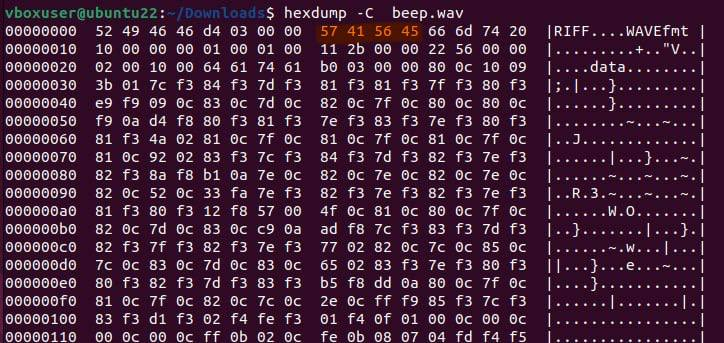

_Для файла beep.wav_

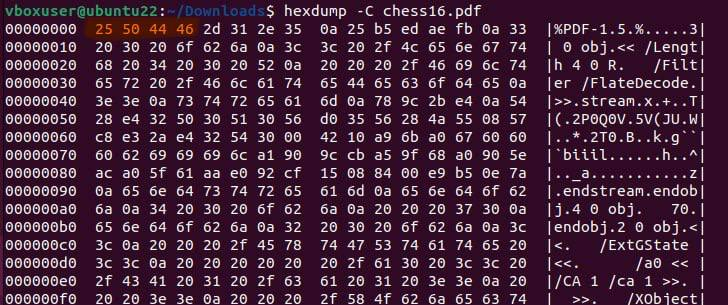
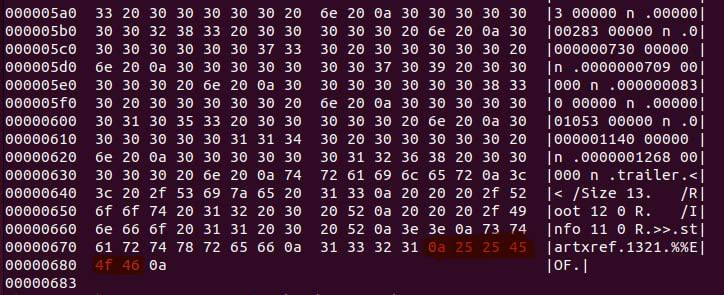

_Для файла chess16.pdf_

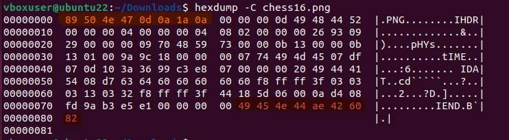

_Для файла chess16.png_

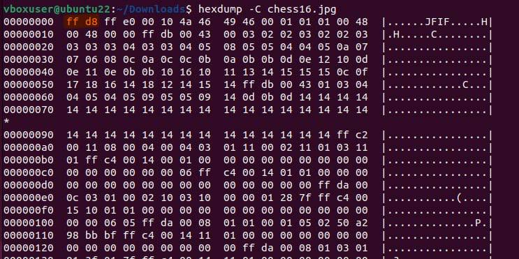
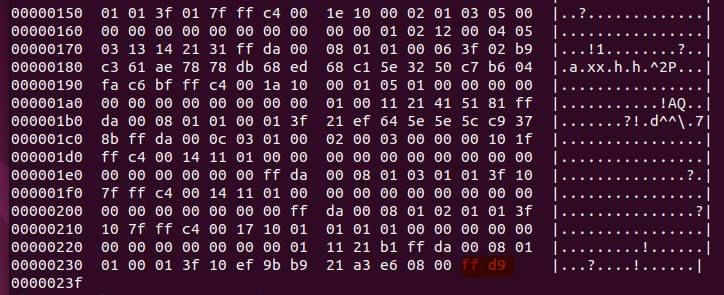

_Для файла chess16.jpg_

>   * Сигнатура файла - набор байтов, обеспечиващий идентификацию типа файла.
>   * Файлы типов: JPEG, PNG, GIF, ZIP, RAR, PDF, имеют не только начальную сигнатуру, но и конечную ( EOF-маркеры). Программы для просмотра фотографий считывают все байты вплоть до этого маркера, однако, область после него остается игнорируемой.

### Задание ЛC.з2.
 Определите тип файла, соответствующего номеру варианта
((№2 − 1)%10)==1, из папки «labs-files/Варианты 1 — *». Откройте его корректным
приложением. Поместите в отчёт тип и описание содержимого файла, а также
признаки формата, по которым удалось определить тип.

 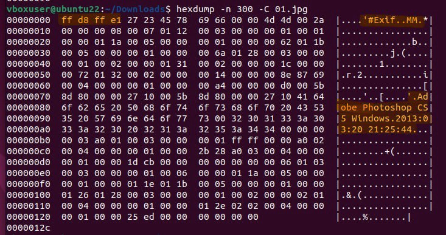

> Этот файл является файлом изображения в формате JPEG. В начале файла есть сегмент Exif, который содержит метаданные о фотографии. В метаданных указано, что изображение было создано в программе Adobe Photoshop CS5 Windows в 2013 году. В файле также содержится информация о настройках камеры в момент съемки, такие как дата и время съемки.

> Последовательность символов "FF D8 FF E1" указывает на то, что тип файла - JPEG и является маркером начала Exif-сегмента в формате JPEG (после нее идут данные Exif-метаданных).
### Задание ЛC.з3. 
В соответствии с номером варианта отредактируйте (таблица ЛC.1) изображение colorchess16x16x2.bmp, используя шестнадцатеричный
редактор.

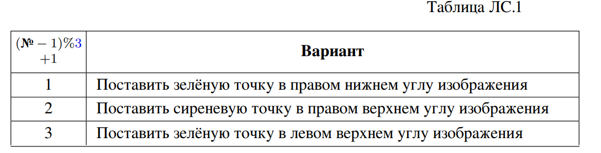

 Откройте изменённый файл и убедитесь, что изменения корректны.
Файл colorchess16x16x2.bmp представляет собой изображение 16×16 пикселей,
сиренево-болотное (две сиреневые и две болотные клетки по 8 × 8 пикселей),
глубина цвета — 1 бит на пиксель. Убедитесь, что просмотровщик отображает его
как цветное (некоторые игнорируют палитру файлов с глубиной 1 бит на пиксель).

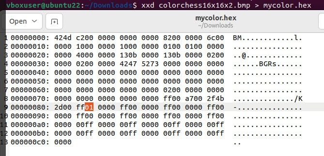

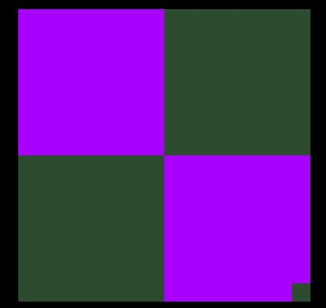

### Задание ЛC.з4.
 С помощью hexdump/xxd или шестнадцатеричного просмотровщика/редактора исследуйте файлы формата «простой текст» (plain text),
представленные в различных кодировках (папка labs-files/Файлы в формате
простого текста — кодировки разные, раздел ЛC.1).Есть ли у простого текста заголовок?
Сравните один и тот же текст, представленный в различных кодировках: размер и шестнадцатеричное представление. Одинаково ли количество байтов для
представления одного печатного символа в различных кодировках? Одинаково
ли шестнадцатеричное представление пробела в различных кодировках? Цифр?
Латинских букв? Русских букв?

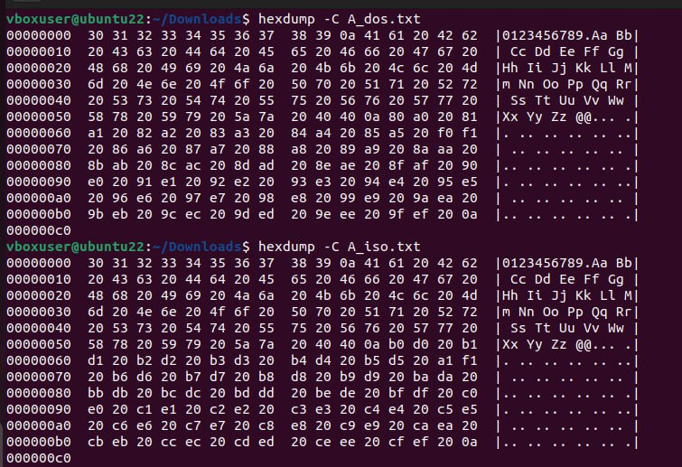

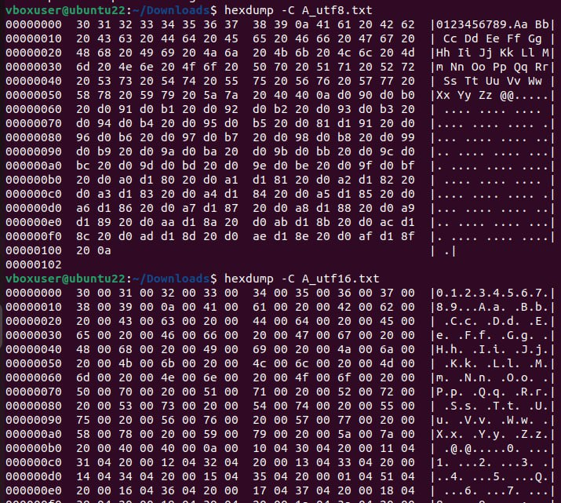

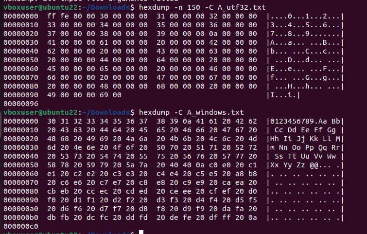

> Как мы видим, много в различных кодировках разное
например в 8-байтовой кодировки под каждый символ и пробел(0) выделяеться 1
байт, для 16-байтовой кодировке выделяется 1 байт на пробел(0) и 2
байта на каждый символ, в 32-байтовой кодировке: 4 байта для
символа, 3 байта на пробел. Представление Цифр и Латинских букв
везде одинаково, а вот с Русскими буквами есть различия.

> В UTF-8 каждый символ занимает разное количество байтов в
зависимости от его кода символа. Пробел в UTF-8 представляется
как 0x20, цифры от 0 до 9 представляются как 0x30 - 0x39,
латинские буквы A-Z представляются как 0x41 - 0x5A, а русские
буквы А-Я представляются как 0xD090 - 0xD19F.

> В UTF-16 каждый символ обычно занимает 2 байта. Пробел в UTF-16
представляется как 0x0020, цифры от 0 до 9 представляются как
0x0030 - 0x0039, латинские буквы A-Z представляются как 0x0041 -
0x005A, а русские буквы А-Я представляются как 0x0410 - 0x042F.

> В UTF-32 каждый символ занимает 4 байта. Пробел в UTF-32
представляется как 0x00000020, цифры от 0 до 9 представляются
как 0x00000030 - 0x00000039, латинские буквы A-Z представляются
как 0x00000041 - 0x0000005A, а русские буквы А-Я представляются
как 0x00000410 - 0x0000042F.

### Задание ЛC.з5. Бонус +1 или +10 баллов. 
Для файла (№ − 1)%9 из папки labs-files/Варианты 2 — определение кодировки простого текста (далее — файл 𝑍):
– определите, является ли 𝑍 простым текстом на русском языке в одной из
стандартных кодировок (один из вариантов представляет собой нерусскоязычный текст);
– если да — определите кодировку и декодируйте в UTF-8.
Если для определения кодировки используется существующая программа определения кодировок, задание засчитывается на +1 балл. Для получения +10 баллов
необходимо провести частотный анализ самостоятельно.
Для проведения частотного анализа выполните следующие шаги.
1. Разработайте программу для определения частот октетов (байтов x86) в заданном файле (это может быть как скрипт-однострочник, использующий
стандартные утилиты GNU/Linux, так и проект на любом языке программирования в любой среде).
Хотя в этом задании далее анализироваться будут файлы в формате
простого текста — программа, анализирующая распределение октетов,
должна корректно обрабатывать любые файлы.
2. Рассчитайте частоты появления октетов в файлах, являющихся осмысленным
русскоязычным текстом достаточного объёма в различных кодировках (папка
labs-files/Файлы в формате простого текста — кодировки разные)
Определите:
– четыре наиболее частых октета среди всех используемых;
– четыре наиболее частых октета, не являющихся кодами печатных символов ASCII; для однобайтовых кодировок сопоставьте соотношение их
частот с частотами символов русского языка.
Обратите внимание на распределение октетов многобайтовых кодировок
Unicode (UTF-8, UTF-16, UTF-32).
3. Рассчитайте частоты появления октетов в файле 𝑍. Определите, аналогично
п. 2, четыре наиболее частых октета среди всех и четыре — среди не являющихся кодами печатных символов ASCII.
Сопоставьте их с результатами п. 2 и с частотами символов русского языка.
Определите наиболее вероятную кодировку или нерусскоязычность текста.
4. Если по результатам п. 3 файл 𝑍 является русскоязычным текстом в кодировке 𝑋 — декодируйте 𝑍 из 𝑋 в UTF-8 любой утилитой перекодировки.
Проверьте корректность результата.

### ЛC.2. Вопросы
1. Для чего нужен шестнадцатеричный редактор?
>  Шестнадцатеричный редактор может быть полезен для просмотра и
редактирования содержимого файлов в шестнадцатеричном
формате. Он позволяет увидеть данные в виде шестнадцатеричных
чисел, что может быть удобно при анализе структуры файла,
поиске конкретных значений или сигнатур.

2. Какие функции libc используются для чтения/записи бинарных файлов?
> Для чтения и записи бинарных файлов в языке программирования
C используются функции из библиотеки libc, такие как fread(),
fwrite(), fopen(), fclose(), fseek(), ftell() и другие. Эти функции позволяют открывать файлы, читать из них или
записывать в них данные, перемещаться по файлу и т.д.

3. Известно, что файл содержит осмысленный русскоязычный текст в одной
из представленных в данной работе кодировок. Можно ли, используя только
шестнадцатеричный редактор, без частотного анализа, отличить UTF-8, UTF-16,
UTF-32: а) друг от друга, б) от однобайтовой кодировки? По каким признакам?
> а) Отличить кодировки UTF-8, UTF-16 и UTF-32 друг от друга с
помощью шестнадцатеричного редактора можно по следующим
признакам:
    UTF-8: В UTF-8 символы с кодами от 0x00 до 0x7F (ASCII)
    представляются одним байтом, символы с кодами от 0x80 до
    0x7FF - двумя байтами, символы с кодами от 0x800 до 0xFFFF
    - тремя байтами и т.д. В шестнадцатеричном представлении

    * UTF-8 вы увидите определенные шаблоны байтов для каждой
    группы символов.

    * UTF-16: В UTF-16 каждый символ обычно занимает 2 байта, и
    вы увидите пары шестнадцатеричных чисел для каждого
    символа.

    * UTF-32: В UTF-32 каждый символ занимает 4 байта, и вы
    увидите четверки шестнадцатеричных чисел для каждого
    символа.
> б) Отличить UTF-8, UTF-16, UTF-32 от однобайтовой кодировки
без частотного анализа сложнее, но возможно. Один из
признаков - наличие BOM (Byte Order Mark). Например, UTF-8
может содержать BOM в виде трех байтов 0xEF, 0xBB, 0xBF в
начале файла, UTF-16 может содержать BOM в виде двух байтов
0xFE, 0xFF или 0xFF, 0xFE, а UTF-32 может содержать BOM в
виде четырех байтов 0x00, 0x00, 0xFE, 0xFF или 0xFF, 0xFE,
0x00, 0x00. Однобайтовые кодировки обычно не используют BOM.
Также можно обратить внимание на распределение нулевых байтов
(0x00) в файле - в однобайтовых кодировках они будут
отсутствовать.
