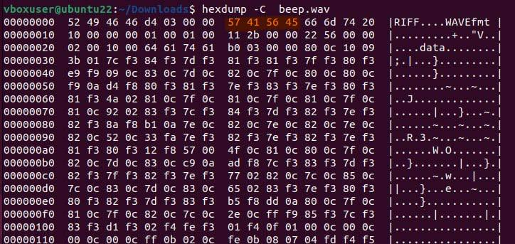
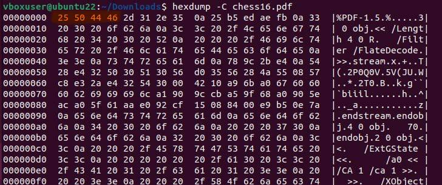
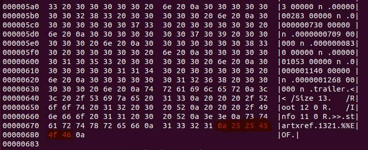
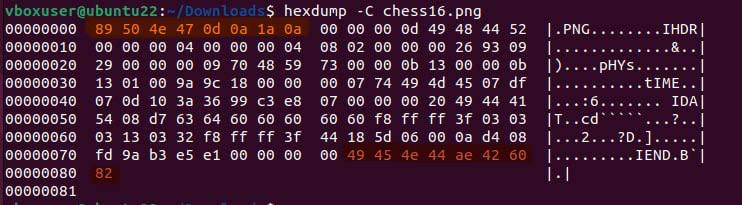
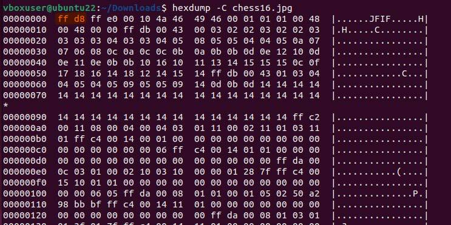
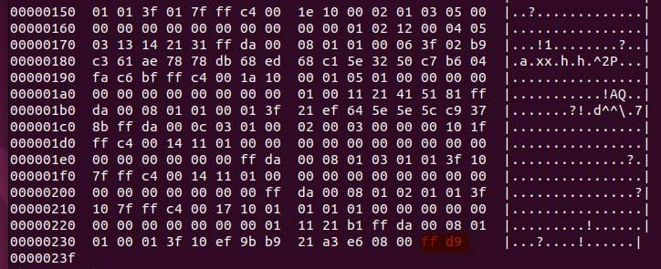
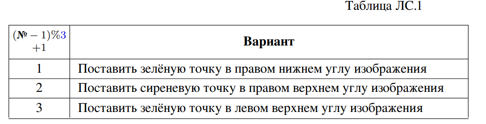

# Лабораторная работа 12 (1100 = C)
# Просмотр и редактирование файлов в шестнадцатеричном представлении. Работа с файлами в C/C++

## Задание на лабораторную работу
### Задание ЛC.з1.
 С помощью hexdump/xxd или шестнадцатеричного просмотровщика/редактора исследуйте файлы различных форматов (некоторые файлы
представлены в папке «labs-files/Файлы в разных форматах»). Выделите сигнатуры
или иные признаки формата там, где это возможно.

* Для файла beep.wav

* Для файла chess16.pdf

* Для файла chess16.png

* Для файла chess16.jpg

>   * Сигнатура файла - набор байтов, обеспечиващий идентификацию типа файла.
   * Файлы типов: JPEG, PNG, GIF, ZIP, RAR, PDF, имеют не только начальную сигнатуру, но и конечную ( EOF-маркеры). Программы для просмотра фотографий считывают все байты вплоть до этого маркера, однако, область после него остается игнорируемой.
### Задание ЛC.з2.
 Определите тип файла, соответствующего номеру варианта
((№ − 1)%10), из папки «labs-files/Варианты 1 — *». Откройте его корректным
приложением. Поместите в отчёт тип и описание содержимого файла, а также
признаки формата, по которым удалось определить тип.
### Задание ЛC.з3. 
В соответствии с номером варианта отредактируйте (таблица ЛC.1) изображение colorchess16x16x2.bmp, используя шестнадцатеричный
редактор. Откройте изменённый файл и убедитесь, что изменения корректны.
Файл colorchess16x16x2.bmp представляет собой изображение 16×16 пикселей,
сиренево-болотное (две сиреневые и две болотные клетки по 8 × 8 пикселей),
глубина цвета — 1 бит на пиксель. Убедитесь, что просмотровщик отображает его
как цветное (некоторые игнорируют палитру файлов с глубиной 1 бит на пиксель).
### Задание ЛC.з4.
 С помощью hexdump/xxd или шестнадцатеричного просмотровщика/редактора исследуйте файлы формата «простой текст» (plain text),
представленные в различных кодировках (папка labs-files/Файлы в формате
простого текста — кодировки разные, раздел ЛC.1).Есть ли у простого текста заголовок?
Сравните один и тот же текст, представленный в различных кодировках: размер и шестнадцатеричное представление. Одинаково ли количество байтов для
представления одного печатного символа в различных кодировках? Одинаково
ли шестнадцатеричное представление пробела в различных кодировках? Цифр?
Латинских букв? Русских букв?
### Задание ЛC.з5. Бонус +1 или +10 баллов. Для файла (№ − 1)%9 из папки labs-files/Варианты 2 — определение кодировки простого текста

(далее — файл 𝑍):
– определите, является ли 𝑍 простым текстом на русском языке в одной из
стандартных кодировок (один из вариантов представляет собой нерусскоязычный текст);
– если да — определите кодировку и декодируйте в UTF-8.
Если для определения кодировки используется существующая программа определения кодировок, задание засчитывается на +1 балл. Для получения +10 баллов
необходимо провести частотный анализ самостоятельно.
Для проведения частотного анализа выполните следующие шаги.
1. Разработайте программу для определения частот октетов (байтов x86) в заданном файле (это может быть как скрипт-однострочник, использующий
стандартные утилиты GNU/Linux, так и проект на любом языке программирования в любой среде).
Хотя в этом задании далее анализироваться будут файлы в формате
простого текста — программа, анализирующая распределение октетов,
должна корректно обрабатывать любые файлы.
2. Рассчитайте частоты появления октетов в файлах, являющихся осмысленным
русскоязычным текстом достаточного объёма в различных кодировках (папка
labs-files/Файлы в формате простого текста — кодировки разные)
Определите:
– четыре наиболее частых октета среди всех используемых;
– четыре наиболее частых октета, не являющихся кодами печатных символов ASCII; для однобайтовых кодировок сопоставьте соотношение их
частот с частотами символов русского языка.
Обратите внимание на распределение октетов многобайтовых кодировок
Unicode (UTF-8, UTF-16, UTF-32).
3. Рассчитайте частоты появления октетов в файле 𝑍. Определите, аналогично
п. 2, четыре наиболее частых октета среди всех и четыре — среди не являющихся кодами печатных символов ASCII.
Сопоставьте их с результатами п. 2 и с частотами символов русского языка.
Определите наиболее вероятную кодировку или нерусскоязычность текста.
4. Если по результатам п. 3 файл 𝑍 является русскоязычным текстом в кодировке 𝑋 — декодируйте 𝑍 из 𝑋 в UTF-8 любой утилитой перекодировки.
Проверьте корректность результата.

### ЛC.2. Вопросы
1. Для чего нужен шестнадцатеричный редактор?
2. Какие функции libc используются для чтения/записи бинарных файлов?
3. Известно, что файл содержит осмысленный русскоязычный текст в одной
из представленных в данной работе кодировок. Можно ли, используя только
шестнадцатеричный редактор, без частотного анализа, отличить UTF-8, UTF-16,
UTF-32: а) друг от друга, б) от однобайтовой кодировки? По каким признакам?
