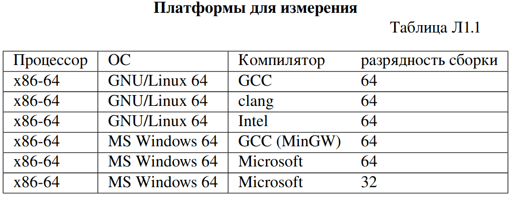
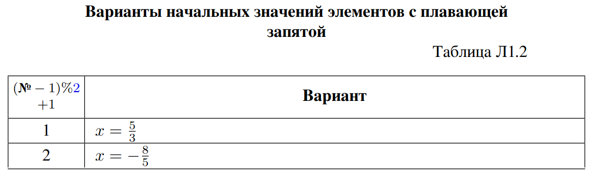
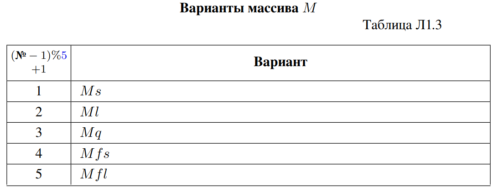

## $$Лабораторная \, работа\, 1 \\ \textbf{Ввод-вывод\, при\, помощи\, libc}$$

### Задание Л1.з1

Разработайте программу, выводящую на стандартный вывод
группу, номер и состав команды при помощи функции $𝑝𝑢𝑡𝑠()$ библиотеки libc.

При работе в ОС MS Windows возможны проблемы с кодировкой русского языка. Если они возникли — используйте транслит или любые доступные вам способы настройки.

```c++
#include <stdio.h>
#include <locale.h>
int main (void)
{ 
   setlocale(LC_ALL,"russian");
   const char *str = "Группа: ПМ-32 \nКоманда №2 \nСостав: Каранкевич M., Комбаров Д., Комольцева Д.";
   puts (str);
               
   return 0;
}
```

### Задание Л1.з2. 
Укажите для платформы, где выполняется работа:
– ОС и разрядность ОС;
– компилятор (должен относиться к коллекции GCC/MinGW) и его версию;
– разрядность сборки (собираемая программа может работать в 32-битном режиме
 даже под 64-битной ОС — в режиме совместимости);
– архитектуру процессора, назначение платформы.

Компьютер с процессором x86/x86-64 под управлением GNU/Linux, BSD (в том
числе Mac OS X) или MS Windows — платформа общего назначения.

При помощи оператора sizeof языка С/С++ выясните, сколько байтов занима-
ют на выбранной платформе переменные следующих типов: char, signed char,
unsigned char, char*, bool, wchar_t, short, int, long, long long,
float, double, long double, size_t, ptrdiff_t, void*.
**Штраф** −2 балла, если выводятся только числа, без пояснений, и непонятно,
где размер какого типа.
**Бонус** +2 балла, если при помощи макроса пояснения выводятся так, что
в коде каждое имя типа в Л1.з2 встречается единожды.

```c++
#include <cstddef>
#include <iostream>
#define print_size(type)\
    std::cout<<"The size of a " #type" is: "<< sizeof(type)<<" bytes"<<std::endl;


int main(){
    // Ubuntu 22.04 LTS, 64 битная версия
    // компилятор g++ (Ubuntu 11.4.0-1ubuntu1~22.04) 11.4.0
    // 
    // AMD® Ryzen 7 5800h
    // x86 -64 , процессор общего назначения


    std::cout  
        <<"Ubuntu 22.04 LTS, 64 битная версия"
        <<"\nКомпилятор g++ (Ubuntu 11.4.0-1ubuntu1~22.04) 11.4.0"
        <<"\nAMD® Ryzen 7 5800h, x86 -64, процессор общего назначения"
        <<std::endl;
    std::cout<<std::endl;
    print_size(char);
    print_size(signed char);
    print_size(unsigned char);
    print_size(char *);
    print_size(bool);
    print_size(wchar_t);
    print_size(short);
    print_size(int);
    print_size(long);
    print_size(long long);
    print_size(float);
    print_size(double);
    print_size(long double);
    print_size(size_t);
    print_size(ptrdiff_t);
    print_size(void *);
    return 0;
}
```
```
Ubuntu 22.04 LTS, 64 битная версия
Компилятор g++ (Ubuntu 11.4.0-1ubuntu1~22.04) 11.4.0
AMD® Ryzen 7 5800h, x86 -64, процессор общего назначения

The size of a char is: 1 bytes
The size of a signed char is: 1 bytes
The size of a unsigned char is: 1 bytes
The size of a char * is: 8 bytes
The size of a bool is: 1 bytes
The size of a wchar_t is: 4 bytes
The size of a short is: 2 bytes
The size of a int is: 4 bytes
The size of a long is: 8 bytes
The size of a long long is: 8 bytes
The size of a float is: 4 bytes
The size of a double is: 8 bytes
The size of a long double is: 16 bytes
The size of a size_t is: 8 bytes
The size of a ptrdiff_t is: 8 bytes
The size of a void * is: 8 bytes
```
### Задание Л1.з3. Бонус +2 балла. 
Выполните измерения согласно заданию Л1.з2 на платформах, доступных на ВЦ (таблица Л1.1).


Связка GNU/Linux 64 + GCC 64 широко используется в онлайн-компиляторах. На godbolt.org (ОС GNU/Linux 64) доступны сборка компиляторами GCC 64, clang 64 и ICC (Intel C++ Compiler) 64 с возможностью запуска; а также сборка без запуска для множества других компиляторов, в том числе для не-x86 процессоров. 

ОС MS Windows 64 и компиляторы GCC и Microsoft доступны на ВЦ локально (для дистанционных занятий — на терминале ВЦ).

Не возбраняется использование инструментов, установленных дома. 

**Штраф** −2 балла за платформу таблицы Л1.1, если в аудитории она доступна, а данных по ней нет.
**Бонус** +2 балла за платформу. При подготовке к работе выполните измерения на платформе, отсутствующей в таблице Л1.1 (укажите ОС, компилятор,
режим (разрядность) сборки, архитектуру процессора, назначение платформы —
без этих сведений баллы не начисляются).
Обратите внимание на размеры целочисленных типов и типов с плавающей
запятой. Какие из них на всех платформах таблицы Л1.1 имеют разрядность 16,
32, 64 бита, учитывая, что байт x86/x86-64 — октет (8 бит)?
```
Процессор x86-64
OC MS Microsoft, 64 версия
Компилятор Microsoft

The size of a char is: 1 bytes
The size of a signed char is: 1 bytes
The size of a unsigned char is: 1 bytes
The size of a char* is: 4 bytes
The size of a bool is: 1 bytes
The size of a wchar_t is: 2 bytes
The size of a short is: 2 bytes
The size of a int is: 4 bytes
The size of a long is: 4 bytes
The size of a long long is: 8 bytes
The size of a float is: 4 bytes
The size of a double is: 8 bytes
The size of a long double is: 8 bytes
The size of a size_t is: 4 bytes
The size of a ptrdiff_t is: 4 bytes
The size of a void* is: 4 bytes
```
```
Процессор x86-64
OC MS Microsoft, 64 версия 
Компилятор GCC (MinGW)

The size of a char is: 1 bytes
The size of a signed char is: 1 bytes
The size of a unsigned char is: 1 bytes
The size of a char * is: 8 bytes
The size of a bool is: 1 bytes
The size of a wchar_t is: 2 bytes
The size of a short is: 2 bytes
The size of a int is: 4 bytes
The size of a long is: 4 bytes
The size of a long long is: 8 bytes
The size of a float is: 4 bytes
The size of a double is: 8 bytes
The size of a long double is: 16 bytes
The size of a size_t is: 8 bytes
The size of a ptrdiff_t is: 8 bytes
The size of a void * is: 8 bytes
```
```
Процессор x86-64
OC GNU/Linux, 64 версия
Компилятор clang 17.0.1

The size of a char is: 1 bytes
The size of a signed char is: 1 bytes
The size of a unsigned char is: 1 bytes
The size of a char * is: 8 bytes
The size of a bool is: 1 bytes
The size of a wchar_t is: 4 bytes
The size of a short is: 2 bytes
The size of a int is: 4 bytes
The size of a long is: 8 bytes
The size of a long long is: 8 bytes
The size of a float is: 4 bytes
The size of a double is: 8 bytes
The size of a long double is: 16 bytes
The size of a size_t is: 8 bytes
The size of a ptrdiff_t is: 8 bytes
The size of a void * is: 8 bytes
```
```
Процессор x86-64
OC MS Microsoft, 64 версия 
Компилятор GCC(MinGW)

The size of a char is: 1 bytes
The size of a signed char is: 1 bytes
The size of a unsigned char is: 1 bytes
The size of a char * is: 8 bytes
The size of a bool is: 1 bytes
The size of a wchar_t is: 2 bytes
The size of a short is: 2 bytes
The size of a int is: 4 bytes
The size of a long is: 4 bytes
The size of a long long is: 8 bytes
The size of a float is: 4 bytes
The size of a double is: 8 bytes
The size of a long double is: 16 bytes
The size of a size_t is: 8 bytes
The size of a ptrdiff_t is: 8 bytes
The size of a void * is: 8 bytes
```
### Задание Л1.з4. 
Разработайте программу на языке C/C++, создающую массивы
из 𝑁 = 5 чисел и инициализирующую их 𝑁 одинаковыми значениями 𝑥:

– 𝑀 𝑠 из 16-битных целых чисел (𝑥 = 0xFADE);

– 𝑀 𝑙 из 32-битных целых чисел (𝑥 = 0x ADE1 A1DA);

– 𝑀 𝑞 из 64-битных целых чисел (𝑥 = 0x C1A5 51F1 AB1E);

– 𝑀 𝑓 𝑠 из 32-битных чисел с плавающей запятой (𝑥 из таблицы Л1.2);

– 𝑀 𝑓 𝑙 из 64-битных чисел с плавающей запятой (𝑥 из таблицы Л1.2).

Тип элементов каждого из массивов определите по результатам заданий Л1.з2/Л1.з3.


Не используйте тип long на 32/64-битных платформах, так как его размер нестабилен. На 16-битной платформе (если найдёте такую) 𝑙𝑜𝑛𝑔 может быть использован как 32-битный тип.

Не используйте типы фиксированной разрядности 𝑖𝑛𝑡𝑋_𝑡 / 𝑢𝑖𝑛𝑡𝑋_𝑡, так как модификаторы размера форматных полей 𝑝𝑟𝑖𝑛𝑡𝑓 () / 𝑠𝑐𝑎𝑛𝑓 () определены не для них, а для 𝑠ℎ𝑜𝑟𝑡, 𝑙𝑜𝑛𝑔 𝑙𝑜𝑛𝑔 и 𝑑𝑜𝑢𝑏𝑙𝑒.

Выведите каждый из массивов на экран при помощи функции libc 𝑝𝑟𝑖𝑛𝑡𝑓 ():

– каждый из целочисленных массивов дважды — как в знаковом десятичном
(формат 𝑑), так и в шестнадцатеричном (𝑋) виде, чтобы убедиться, что корот-
кие значения не расширены до 32 бит, а длинные — не усечены; в шестнадцате-
ричном виде дополняйте код ведущими нулями до необходимого количества
цифр (то есть: для 16-битных 𝑠ℎ𝑜𝑟𝑡 используйте 04ℎ𝑋, для 32 - битных на
32/64-битных платформах 𝑖𝑛𝑡 — 08𝑋, для 64 -битных на 32/64-битных плат-
формах 𝑙𝑜𝑛𝑔 𝑙𝑜𝑛𝑔 — 016𝑙𝑙𝑋);

– каждый из массивов с плавающей запятой также выведите дважды — с двумя
знаками после десятичной запятой (формат 𝑓 : для 𝑓 𝑙𝑜𝑎𝑡 используйте .2𝑓 , для
𝑑𝑜𝑢𝑏𝑙𝑒 — .2𝑙𝑓 ) и в экспоненциальной форме (формат 𝑒: 𝑒 и 𝑙𝑒).
Обратите внимание, что для типов, отличных от 𝑖𝑛𝑡 / 𝑢𝑛𝑠𝑖𝑔𝑛𝑒𝑑 / 𝑓 𝑙𝑜𝑎𝑡, необходимо указывать размер при помощи модификатора перед форматом ввода/вывода.

**Штраф** −1 балл, если вместо именованной константы 𝑁 здесь и/или позже
используется литерал 5.

**Бонус** +1 балл, если вывод массива в двух формах описан как функция и
в последующих заданиях используется вызов этой функции, а не копирование
и вставка;
 +2 балла, если эта функция описана как единый для всех массивов
шаблон и принимает тип как параметр шаблона, а адрес начала 𝑀 , длину 𝑁 и фор-
маты с модификатором размера как параметры функции;
 +3 балла, если вывод описан как единый для всех массивов макрос с соответствующими параметрами.

```c++
#include <iostream>
#define N 5


#define PRINT_f(arr,type)\
    std::cout << "\n\n"#arr " in decimal: "; \
    for (int i = 0; i < N; i++) { printf("%.2f ", arr[i]); } \
    std::cout << "\n"#arr " in exp:     "; \
    for (int i = 0; i < N; i++) { printf("%.2e ", arr[i]); } \
    std::cout<<std::endl;

#define PRINT_i(arr,type)\
    std::cout << "\n\n"#arr " in decimal: "; \
    for (int i = 0; i < N; i++) { printf("%lld ", static_cast<long long>(arr[i])); } \
    std::cout << "\n"#arr " in hex:     "; \
    for (int i = 0; i < N; i++) { printf("%#0*llx ", (int)(sizeof(type)*2 + 2), static_cast<long long>(arr[i]));} \
    std::cout << std::endl;

int main(){
    int xs=0xFADE;
    long long xl = 0xADE1A1DA;
    long long xq = 0xC1A551F1AB1E;
    float x1 = -8.0f/5.0f;
    double x2 = -8.0/5.0;
    int Ms[N]{xs,xs,xs,xs,xs};
    long long Ml[N]{xl,xl,xl,xl,xl};
    long long Mq[N]{xq,xq,xq,xq,xq};
    float Mfs[N]{x1,x1,x1,x1,x1};
    double Mfl[N]{x2,x2,x2,x2,x2};


    PRINT_i(Ms,int);
    PRINT_i(Ml,long long);
    PRINT_i(Mq,long long);
    PRINT_f(Mfs,float);
    PRINT_f(Mfl,double);

    return 0;
}
```
```
Ms in decimal: 64222 64222 64222 64222 64222 
Ms in hex:     0x0000fade 0x0000fade 0x0000fade 0x0000fade 0x0000fade 


Ml in decimal: 2917245402 2917245402 2917245402 2917245402 2917245402 
Ml in hex:     0x00000000ade1a1da 0x00000000ade1a1da 0x00000000ade1a1da 0x00000000ade1a1da 0x00000000ade1a1da 


Mq in decimal: 212915788557086 212915788557086 212915788557086 212915788557086 212915788557086 
Mq in hex:     0x0000c1a551f1ab1e 0x0000c1a551f1ab1e 0x0000c1a551f1ab1e 0x0000c1a551f1ab1e 0x0000c1a551f1ab1e 


Mfs in decimal: -1.60 -1.60 -1.60 -1.60 -1.60 
Mfs in exp:     -1.60e+00 -1.60e+00 -1.60e+00 -1.60e+00 -1.60e+00 


Mfl in decimal: -1.60 -1.60 -1.60 -1.60 -1.60 
Mfl in exp:     -1.60e+00 -1.60e+00 -1.60e+00 -1.60e+00 -1.60e+00 
```
### Задание Л1.з5.
 Для одного из массивов 𝑀 (по варианту согласно табли-
це Л1.3) выведите на экран адреса



– начала массива — 𝑀 ;

– начального (нулевого) элемента массива — &(𝑀 [0]);

– следующего (с индексом 1) элемента массива — &(𝑀 [1]);

при помощи функции libc 𝑝𝑟𝑖𝑛𝑡𝑓 () как указатели (формат 𝑝). Сравните полученные
значения между собой и с размером элемента массива 𝑀 .

```c++
#include <iostream>

#define N 5
int main(){
    unsigned int M[N]{0xADE1A1DA,0xADE1A1DA,0xADE1A1DA,0xADE1A1DA,0xADE1A1DA};
    std::cout
    <<"Адрес начала массива "<<&M
    <<"\nАдрес нулевого элемента "<<&(M[0])
    <<"\nАдрес первого элемента "<<&(M[1])
    <<std::endl;

    return 0;
}
```
```
Адрес начала массива 0x7fff5e3eb460
Адрес нулевого элемента 0x7fff5e3eb460
Адрес первого элемента 0x7fff5e3eb464
```
### Задание Л1.з6.
 Для каждого массива 𝑀 из пяти созданных введите с клавиа-
туры новое значение элемента 𝑀 [𝑖], 𝑖 = 2 при помощи функции libc 𝑠𝑐𝑎𝑛𝑓 ().

Проанализировав возвращённое 𝑠𝑐𝑎𝑛𝑓 () значение, определите корректность
ввода; при необходимости отобразите сообщение об ошибке при помощи функции
libc 𝑝𝑢𝑡𝑠(). Очистка буфера после некорректного ввода во всех заданиях данной
лабораторной работы необязательна.

Выведите массивы на экран до и после ввода, каждый раз — в обеих формах,
описанных в Л1.з4; убедитесь, что элемент 𝑀 [𝑖] приобрёл ожидаемое значение,
а другие элементы массива не изменились (если изменились — проверьте, верно ли
вы указали модификатор размера).

В данном задании необходимо передать функции 𝑠𝑐𝑎𝑛𝑓 () адрес 𝑀 [𝑖], а не
промежуточной переменной — иначе нет смысла контролировать значение сосед-
них элементов массива. Штраф −2 балла, если используется промежуточная
переменная для ввода-вывода.
```c++
#include <iostream>
#define N 5


#define PRINT_f(arr,type)\
    std::cout << "\n\n"#arr " in decimal: "; \
    for (int i = 0; i < N; i++) { printf("%.2f ", arr[i]); } \
    std::cout << "\n"#arr " in exp:     "; \
    for (int i = 0; i < N; i++) { printf("%.2e ", arr[i]); } \
    std::cout<<std::endl;

#define PRINT_i(arr,type)\
    std::cout << "\n\n"#arr " in decimal: "; \
    for (int i = 0; i < N; i++) { printf("%lld ", static_cast<long long>(arr[i])); } \
    std::cout << "\n"#arr " in hex:     "; \
    for (int i = 0; i < N; i++) { printf("%#0*llx ", (int)(sizeof(type)*2 + 2), static_cast<long long>(arr[i]));} \
    std::cout << std::endl;

int main(){
    int xs=0xFADE;
    long long xl = 0xADE1A1DA;
    long long xq = 0xC1A551F1AB1E;
    float x1 = -8.0f/5.0f;
    double x2 = -8.0/5.0;
    int Ms[N]{xs,xs,xs,xs,xs};
    long long Ml[N]{xl,xl,xl,xl,xl};
    long long Mq[N]{xq,xq,xq,xq,xq};
    float Mfs[N]{x1,x1,x1,x1,x1};
    double Mfl[N]{x2,x2,x2,x2,x2};
    std::cout<<"Ms :";
    if (!(scanf("%d",&Ms[2])==1)){
        puts("incorect Ms[2]");
    }
    std::cout<<"Ml :";
    if (!(scanf(" %lld",&Ml[2])==1)){
        puts("incorect Ml[2]");
    }
    std::cout<<"Mq :";
    if (!(scanf("%lld",&Mq[2])==1)){
        puts("incorect Mq[2]");
    }
    std::cout<<"Mfs :";
    if (!(scanf(" %f",&Mfs[2])==1)){
        puts("incorect Mfs[2]");
    }
    std::cout<<"Mfl :";
    if (!(scanf(" %lf",&Mfl[2])==1)){
        puts("incorect Mfl[2]");
    }
    PRINT_i(Ms,int);
    PRINT_i(Ml,long long);
    PRINT_i(Mq,long long);
    PRINT_f(Mfs,float);
    PRINT_f(Mfl,double);

    return 0;
}
```
### Задание Л1.з7.Бонус +1 балл.
 Если поддерживается модификатор размера
ℎℎ, выполните задания Л1.з4 и Л1.з6 также для массива 𝑀 𝑏 из 𝑁 8 -битных целых
чисел (0xED).

Проверяйте перед защитой, действительно ли ℎℎ поддерживается! Если некор-
ректность ввода/вывода выяснится в процессе защиты, задание не засчитывается.

Обходной способ ввода-вывода байта (с использованием либо потоков, либо
𝑝𝑟𝑖𝑛𝑡𝑓 () / 𝑠𝑐𝑎𝑛𝑓 ()) может быть оценен на +1 балл независимо от Л1.з7, но выполнением Л1.з7 не является, так как неизбежно использование промежуточных
переменных.
```c++
#include <iostream>
#define N 5


#define PRINT_f(arr,type)\
    std::cout << "\n\n"#arr " in decimal: "; \
    for (int i = 0; i < N; i++) { printf("%.2f ", arr[i]); } \
    std::cout << "\n"#arr " in exp:     "; \
    for (int i = 0; i < N; i++) { printf("%.2e ", arr[i]); } \
    std::cout<<std::endl;

#define PRINT_i(arr,type)\
    std::cout << "\n\n"#arr " in decimal: "; \
    for (int i = 0; i < N; i++) { printf("%lld ", static_cast<long long>(arr[i])); } \
    std::cout << "\n"#arr " in hex:     "; \
    for (int i = 0; i < N; i++) { printf("%#0*llx ", (int)(sizeof(type)*2 + 2), static_cast<long long>(arr[i]));} \
    std::cout << std::endl;

int main(){
    unsigned char xs=0xED;    
    unsigned char Ms[N]{xs,xs,xs,xs,xs};

    std::cout<<"Ms :";
    if (!(scanf("%hhx",&Ms[2])==1)){
        puts("incorect Ms[2]");
    }

    PRINT_i(Ms,unsigned char);
    return 0;
}
```
### Задание Л1.з8. Бонус +1 балл.
 Для одного из массивов 𝑀 (по варианту
согласно таблице Л1.3) введите с клавиатуры новое значение всех пяти элементов
при помощи одного вызова функции libc 𝑠𝑐𝑎𝑛𝑓 ().

Проанализировав возвращённое 𝑠𝑐𝑎𝑛𝑓 () значение, определите корректность
ввода; при необходимости отобразите сообщение о количестве введённых и не
введённых элементов.

Выведите массив на экран до и после ввода; убедитесь, что количество изме-
нившихся элементов соответствует ожиданиям.
### Задание Л1.з9.Бонус +2 балла для пар, обязательное для троек.
 Введите с клавиатуры (каждую строку — одним вызовом 𝑠𝑐𝑎𝑛𝑓 ()):
а) слово (строку без пробелов) s1 (формат s без модификаторов);
б) слово s2 таким образом, чтобы принимающий его буфер гарантированно
не переполнился: если буфер длины 𝑘 — вводить не более 𝑘 − 1 символов
(ширина поля ввода задаётся аналогично ширине поля вывода);
в) строку, возможно, содержащую пробелы s3 (формат [] — регулярное выра-
жение Perl).

Выведите на экран при помощи функций libc строки «\*\*\*s1\***», «\*\*\*s2\*\*\*», «\*\*\*s3\*\*\*» (между звёздочками должна быть введённые строки, а не литералы s1-s3) и убедитесь, что ввод корректен.

**Л1.1. Дополнительные бонусные и штрафные баллы**
−3 балла за утечку памяти (выделенные, но не освобождённые блоки динами-
ческой памяти).

```c++
#include <stdio.h>
#include <string.h>
#include <locale.h>

int main() {
    setlocale(LC_ALL, "russian");

    char s1[100], s2[100], s3[100];

    printf("Введите слово s1: ");
    scanf("%s", s1);

    printf("Введите слово s2 (не более 99 символов): ");
    scanf("%99s", s2);

    while (getchar() != '\n'); // Clear input buffer

    printf("Введите строку s3: ");
    fgets(s3, sizeof(s3), stdin);
    s3[strcspn(s3, "\n")] = 0;  // Remove newline character from s3

    printf("***%s***\n", s1);
    printf("***%s***\n", s2);
    printf("***%s***\n", s3);

    return 0;
}

```


## Л1.3. Вопросы
1. Какие функции libc используются для форматированного ввода/вывода?
2. Как задаётся формат ввода/вывода для 𝑠𝑐𝑎𝑛𝑓 ()/𝑝𝑟𝑖𝑛𝑡𝑓 ()?
3. Как задаётся размер вводимых/выводимых чисел (а для строк — размер сим-
волa 𝑐ℎ𝑎𝑟/𝑤𝑐ℎ𝑎𝑟_𝑡) для 𝑠𝑐𝑎𝑛𝑓 ()/𝑝𝑟𝑖𝑛𝑡𝑓 ()?
