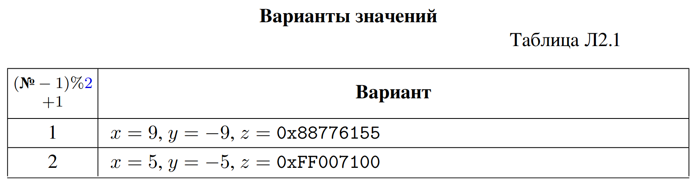

## $$Лабораторная\, работа\, 2\, (0010 = 2)\\ Представление\, данных\, в\,ЭВМ$$

### Задание Л2.з1. 
Разработайте функцию void 𝑣𝑖𝑒𝑤𝑃𝑜𝑖𝑛𝑡𝑒𝑟(void * 𝑝), которая
принимает нетипизированный указатель 𝑝, преобразует его в типизированные:
1. char *p1 = reinterpret_cast<char *>(p);
2. unsigned short *p2 = reinterpret_cast<unsigned short *>(p);
3. double *p3 = reinterpret_cast<double *>(p);

и печатает 𝑝, 𝑝1, 𝑝2, 𝑝3 (не значения по этим адресам, а сами адреса). Убедитесь, что 𝑝, 𝑝1, 𝑝2, 𝑝3 — один и тот же адрес, то есть что оператор reinterpret_cast не меняет преобразуемого указателя и, следовательно, может быть использован для интерпретации одной и той же области памяти как значений различных типов.

Дополните 𝑣𝑖𝑒𝑤𝑃𝑜𝑖𝑛𝑡𝑒𝑟() печатью смежных с 𝑝 адресов: 𝑝1 + 1, 𝑝2 + 1, 𝑝3 + 1. Сопоставьте разницу между 𝑝𝑖 и 𝑝𝑖 + 1 в байтах для типизированного указателя 𝑇 * 𝑝𝑖 с размером типа 𝑇 . Проверьте, позволяют ли текущие настройки компилятора рассчитать 𝑝 + 1. Если да — какова разница между 𝑝 и 𝑝 + 1 в байтах?

При выводе в поток указателя 𝑝1 (на однобайтовый целый тип) результат отли-
чается от 𝑝, 𝑝2, 𝑝3 — так как в C/C++ не определён строковый тип, вместо строк используются массивы однобайтовых целых и основанные на них классы. Соответственно, оператор << для указателей на типы 𝑐ℎ𝑎𝑟 / 𝑢𝑛𝑠𝑖𝑔𝑛𝑒𝑑 𝑐ℎ𝑎𝑟 / 𝑖𝑛𝑡8_𝑡 / 𝑢𝑖𝑛𝑡8_𝑡 перегружен и печатает не адрес, а значения байтов в символьной форме, начиная с указанного адреса и до ближайшего нулевого байта. Для вывода такого указателя как адреса его надо преобразовать reinterpret_cast к нетипизированному void *. Так как в Л2.з1 reinterpret_cast<void *>(p1) — это 𝑝, в поток имеет смысл выводить: 𝑝, 𝑝2, 𝑝3 и reinterpret_cast<void *>(p1+1), 𝑝2 + 1, 𝑝3 + 1.

При выводе с помощью 𝑝𝑟𝑖𝑛𝑡𝑓 () формат вывода определяется не типом аргумента, а форматной строкой; в формате 𝑝 (вывод целого числа как адреса) можно вывести все указатели: 𝑝, 𝑝1, 𝑝2, 𝑝3 и 𝑝1 + 1, 𝑝2 + 1, 𝑝3 + 1.
```c++
#include <iostream>
#include <iomanip>

void viewPointer(void* p){
    std::cout<<"address void *p is               "<<p<<std::endl;

    static char *p1 = reinterpret_cast<char *>(p);
    std::cout<<"address char *p1 is              "<<p<<std::endl;
    std::cout<<"address char *p1 +1 is           "<<reinterpret_cast<void *>(p1+1)<<std::endl;

    unsigned short *p2 = reinterpret_cast<unsigned short *>(p);
    std::cout<<"address unsigned short *p2 is    "<<p2<<std::endl;
    std::cout<<"address unsigned short *p2 +1 is "<<p2+1<<std::endl;

    double *p3 = reinterpret_cast<double *>(p);
    std::cout<<"address double *p3 is            "<<p3<<std::endl;
    std::cout<<"address double *p3 +1 is         "<<p3+1<<std::endl;

}

int main(){
    char a='g';
    void* p=reinterpret_cast<void *>(&a);
    viewPointer(p);

    return 0;
}
```
```
address void *p is               0x7fff0012527f
address char *p1 is              0x7fff0012527f
address char *p1 +1 is           0x7fff00125280
address unsigned short *p2 is    0x7fff0012527f
address unsigned short *p2 +1 is 0x7fff00125281
address double *p3 is            0x7fff0012527f
address double *p3 +1 is         0x7fff00125287
```
### Задание Л2.з2. 
Разработайте функцию void 𝑝𝑟𝑖𝑛𝑡𝑃𝑜𝑖𝑛𝑡𝑒𝑟(void *𝑝), которая
принимает нетипизированный указатель 𝑝, преобразует его в типизированные
𝑝1, 𝑝2, 𝑝3 аналогично 𝑣𝑖𝑒𝑤𝑃𝑜𝑖𝑛𝑡𝑒𝑟() и печатает значения соответствующих типов по адресу 𝑝: *𝑝1, *𝑝2, *𝑝3. Можно ли рассчитать (и, соответственно, напечатать) *𝑝? Дополните 𝑝𝑟𝑖𝑛𝑡𝑃𝑜𝑖𝑛𝑡𝑒𝑟() печатью значений по смежным с 𝑝 адресам:
*(𝑝1 + 1), *(𝑝2 + 1), *(𝑝3 + 1).

Все целые числа выводите в шестнадцатеричном виде. Проверьте рабо-
ту функции 𝑝𝑟𝑖𝑛𝑡𝑃 𝑜𝑖𝑛𝑡𝑒𝑟() на значениях 0x1122334455667788 (𝑙𝑜𝑛𝑔 𝑙𝑜𝑛𝑔), "0123456789abcdef" (𝑐ℎ𝑎𝑟[]).

При выводе в поток режим вывода целых чисел переключается манипулято-
рами ℎ𝑒𝑥/𝑑𝑒𝑐/𝑜𝑐𝑡 (или методом 𝑠𝑒𝑡𝑓 () с одноимёнными флагами, или методом 𝑠𝑒𝑡𝑏𝑎𝑠𝑒(), принимающим аргументы 16, 10, 8); режим вывода действует на все целые числа до его смены. Так, для вывода всех в шестнадцатеричном виде — в начале 𝑚𝑎𝑖𝑛() напечатайте манипулятор ℎ𝑒𝑥. На вывод чисел с плавающей запятой манипуляторы ℎ𝑒𝑥, 𝑜𝑐𝑡, 𝑑𝑒𝑐 никакого влияния не оказывают.

При выводе с помощью 𝑝𝑟𝑖𝑛𝑡𝑓 () используйте формат вывода 𝑋 с соответствующим модификатором размера перед 𝑋.
```c++
#include <iostream>
#include <iomanip>

void printPointer(void* p){

    static char *p1 = reinterpret_cast<char *>(p);
    std::cout<<"value of char *p1 is              "<<*p1<<std::endl;
    std::cout<<"value of char *p1 +1 is           "<<*(p1+1)<<std::endl;

    unsigned short *p2 = reinterpret_cast<unsigned short *>(p);
    std::cout<<"value of unsigned short *p2 is    "<<*p2<<std::endl;
    std::cout<<"value of unsigned short *p2 +1 is "<<*(p2+1)<<std::endl;

    double *p3 = reinterpret_cast<double *>(p);
    std::cout<<"value of double *p3 is            "<<*p3<<std::endl;
    std::cout<<"value of double *p3 +1 is         "<<*(p3+1)<<std::endl;

}

int main(){
    std::cout<<std::hex;
    char b[] ="0123456789abcdef";
    long long a=0x1122334455667788;

    std::cout<<"test value = 0x1122334455667788"<<std::endl;
    void* p=reinterpret_cast<void *>(&a);
    printPointer(p);

    std::cout<<std::endl;

    std::cout<<"test value = \"0123456789abcdef\""<<std::endl;
    p=reinterpret_cast<void *>(&b);
    printPointer(p);

    
    return 0;
}
```
```
test value = 0x1122334455667788
value of char *p1 is              �
value of char *p1 +1 is           w
value of unsigned short *p2 is    7788
value of unsigned short *p2 +1 is 5566
value of double *p3 is            3.84141e-226
value of double *p3 +1 is         6.9532e-310

test value = "0123456789abcdef"
value of char *p1 is              �
value of char *p1 +1 is           w
value of unsigned short *p2 is    3130
value of unsigned short *p2 +1 is 3332
value of double *p3 is            9.95833e-43
value of double *p3 +1 is         1.81795e+185
```
### Задание Л2.з3.
 Разработайте функцию void 𝑝𝑟𝑖𝑛𝑡𝐷𝑢𝑚𝑝(void * 𝑝, size_t 𝑁 ),
которая принимает нетипизированный указатель 𝑝, преобразует его в типизиро-
ванный указатель на байт 𝑢𝑛𝑠𝑖𝑔𝑛𝑒𝑑 𝑐ℎ𝑎𝑟 * 𝑝1 и печатает шестнадцатеричные значения 𝑁 байтов, начиная с этого адреса: *𝑝1, *(𝑝1 + 1), ... *(︁ 𝑝1 + (𝑁 − 1))︁ — шестнадцатеричный дамп памяти. Каждый байт должен выводиться в виде двух шестнадцатеричных цифр; байты разделяются пробелом.
С помощью 𝑝𝑟𝑖𝑛𝑡𝐷𝑢𝑚𝑝() определите и выпишите в отчёт, как хранятся в памяти компьютера в программе на C/C++:

– целое число 𝑥 (типа 𝑖𝑛𝑡; таблица Л2.1); по результату исследования опреде-
лите порядок следования байтов в словах для вашего процессора:
1. прямой (младший байт по младшему адресу, порядок Intel, Little-Endian,
от младшего к старшему);
2. обратный (младший байт по старшему адресу, порядок Motorola, Big-
Endian, от старшего к младшему);

– массив из трёх целых чисел (статический или динамический, но не высоко-
уровневый контейнер) с элементами 𝑥, 𝑦, 𝑧;
– число с плавающей запятой 𝑦 (типа 𝑑𝑜𝑢𝑏𝑙𝑒; таблица Л2.1).

При выводе в поток: однобайтовые целочисленные переменные (не только
𝑐ℎ𝑎𝑟 / 𝑢𝑛𝑠𝑖𝑔𝑛𝑒𝑑 𝑐ℎ𝑎𝑟, но часто и 𝑖𝑛𝑡8_𝑡 / 𝑢𝑖𝑛𝑡8_𝑡) выводятся в поток в виде сим-
вола, код которого равен значению переменной (независимо от манипуляторов
ℎ𝑒𝑥/𝑜𝑐𝑡/𝑑𝑒𝑐). Для вывода в поток значения однобайтовой переменной в виде шест-
надцатеричного, десятичного или восьмеричного числа необходимо расширить это
значение до двух- или более байтового типа. Для корректного шестнадцатерич-
ного вывода байта необходимо дополнить его нулями (беззнаковое расширение),
то есть преобразовать 𝑢𝑛𝑠𝑖𝑔𝑛𝑒𝑑 𝑐ℎ𝑎𝑟 в 𝑢𝑛𝑠𝑖𝑔𝑛𝑒𝑑 𝑠ℎ𝑜𝑟𝑡 или 𝑢𝑛𝑠𝑖𝑔𝑛𝑒𝑑 и т. п. Для
преобразования значения в значение в C++ используется оператор static_cast,
то есть для печати 𝑖-го байта *(p1+i) типа 𝑢𝑛𝑠𝑖𝑔𝑛𝑒𝑑 𝑐ℎ𝑎𝑟 следует выводить
в поток: static_cast<unsigned>( *(p1+i) ). Вместо static_cast можно ис-
пользовать универсальное приведение в стиле C, но это не рекомендуется.

При выводе с помощью 𝑝𝑟𝑖𝑛𝑡𝑓 () используйте формат 02ℎℎ𝑋; в этом случае
никакое преобразование не нужно.
```c++
#include <iostream>
#include <iomanip>

void printDump(void* p,size_t N){
    unsigned char * p1= reinterpret_cast<unsigned char *>(p);
    for (size_t i=0;i<N;i++){
        printf("%02hhX ",*(p1+i));
    }
    printf("\n");

}

int main(){

    std::cout<<"item 1"<<std::endl;
    int a=5;
    void* p=reinterpret_cast<void *>(&a);
    printDump(p,4);

    std::cout<<"item 2"<<std::endl;
    int b[]={5,-5,(int)0xFF007100};
    p=reinterpret_cast<void *>(&b);
    printDump(p,12);

    std::cout<<"item 3"<<std::endl;
    double c=1.5;
    p=reinterpret_cast<void *>(&c);
    printDump(p,8);

    return 0;
}
```
```
item 1
05 00 00 00 
item 2
05 00 00 00 FB FF FF FF 00 71 00 FF 
item 3
00 00 00 00 00 00 F8 3F 
```
**Бонус +2 балла за платформу.** При подготовке к работе выполните измере-
ния на платформе, где архитектура процессора отлична от x86/x86-64.
### Задание Л2.з4.
 Изучите, как интерпретируется одна и та же область памяти,
если она рассматривается как знаковое или беззнаковое целое число, а также —
как одно и то же число записывается в различных системах счисления.

Для этого на языке C/C++ разработайте функцию void 𝑝𝑟𝑖𝑛𝑡16(void * 𝑝),
которая печатает для области памяти по заданному адресу 𝑝:
а) целочисленную беззнаковую 16-битную интерпретацию (𝑢𝑛𝑠𝑖𝑔𝑛𝑒𝑑 𝑠ℎ𝑜𝑟𝑡)
в шестнадцатеричном представлении;
б) целочисленную беззнаковую 16-битную интерпретацию (𝑢𝑛𝑠𝑖𝑔𝑛𝑒𝑑 𝑠ℎ𝑜𝑟𝑡)
в двоичном представлении;
в) целочисленную беззнаковую 16-битную интерпретацию (𝑢𝑛𝑠𝑖𝑔𝑛𝑒𝑑 𝑠ℎ𝑜𝑟𝑡) в де-
сятичном представлении (для 𝑝𝑟𝑖𝑛𝑡𝑓 () используйте формат 𝑢: она умеет
выводить любые целые в любом представлении, и требуется явное указание);
г) целочисленную знаковую 16-битную интерпретацию (𝑠ℎ𝑜𝑟𝑡) в шестнадцате-
ричном представлении;
д) целочисленную знаковую 16-битную интерпретацию (𝑠ℎ𝑜𝑟𝑡) в двоичном пред-
ставлении;
е) целочисленную знаковую 16- битную интерпретацию (𝑠ℎ𝑜𝑟𝑡) в десятичном
представлении (для 𝑝𝑟𝑖𝑛𝑡𝑓 () используйте формат 𝑑).
**Штраф −2 балла**, если количество выводимых цифр двоичного представле-
ния отлично от количества бит в числе (\frac{16}{4}=4 для 𝑝𝑟𝑖𝑛𝑡16()) либо если количество
выводимых цифр шестнадцатеричного представления отлично от количества тет-
рад в числе ( 16 4 = 4 для 𝑝𝑟𝑖𝑛𝑡16()).
**Бонус +1 балл**, если вывод 𝑝𝑟𝑖𝑛𝑡16() занимает одну строку (так на экран
поместится больше чисел). **Бонус +2 балла**, если при этом младшая цифра нахо-
дится под младшей цифрой предыдущей строки (чего можно добиться заданием
ширины поля вывода).

Для получения различных интерпретаций участка памяти по адресу 𝑝 в C++
можно использовать преобразование указателя 𝑝 в указатель на другой тип оператором reinterpret_cast с последующим разыменованием. Обратите внимание,
что разыменованный указатель является lvalue (может стоять слева от оператора
присваивания), то есть различные интерпретации можно использовать не только
для просмотра, но и для изменения участка памяти по адресу 𝑝.

Так, целочисленная беззнаковая интерпретация 16 бит памяти по адресу 𝑝
для (а) и (в) — *(reinterpret_cast<unsigned short *>(p)), знаковая для (г)
и (е) — *(reinterpret_cast<short *>(p)) (см. разделы 7.2 и 7.3).

Вместо reinterpret_cast можно использовать универсальное приведение
в стиле C, но его использование в коде на C++ не рекомендуется.

Обратите внимание, что преобразование значения в значение оператором
static_cast или приведением в стиле C не обеспечивает необходимого эффекта;
хотя для целых типов одного размера 𝑠𝑖𝑔𝑛𝑒𝑑 ↔ 𝑢𝑛𝑠𝑖𝑔𝑛𝑒𝑑 преобразование значения в значение чаще всего приводит к тому же результату, что reinterpret_cast \+ разыменование, но уже для плавающей запятой это не так.

При выводе в поток двоичное (битовое) представление чисел можно получить,
используя шаблон std::bitset\<N>, где 𝑁 — количество бит в представлении —
необходимо задать вручную.

При выводе с помощью 𝑝𝑟𝑖𝑛𝑡𝑓 () в новейших версиях GCC можно использовать форматы 𝑏 и 𝐵 с соответствующим модификатором размера; в более старых, где 𝑏 и 𝐵 не поддерживаются, необходимо вручную выделять и выводить биты числа.

Отсутствие двоичного представления (б)/(д) не штрафуется в том случае, если
для студента не составляет труда прочитать шестнадцатеричное представление
(а)/(г) и записать по нему двоичное для любого выбранного числа.
Проверьте работу функции 𝑝𝑟𝑖𝑛𝑡16() на 16-битных целочисленных переменных, принимающих следующие значения:
– минимальное целое 16-битное значение без знака;
– максимальное целое 16-битное значение без знака;
– минимальное целое 16-битное значение со знаком;
– максимальное целое 16-битное значение со знаком;
– значение 𝑥, соответствующее варианту (таблица Л2.1);
– значение 𝑦, соответствующее варианту (таблица Л2.1);
(запишите каждое из значений в 16 -битную целочисленную переменную и передайте
её адрес функции).

Убедитесь, что (б) и (д) — одно и то же двоичное представление.
Убедитесь, что (а) и (г) — одно и то же шестнадцатеричное представление.

Шестнадцатеричный формат вывода для целочисленных переменных использует-
ся как компактная запись двоичного кода, а не альтернативное представление
значения, поэтому результат совпадает для беззнаковой и знаковой целочислен-
ных интерпретаций 𝑝 (и равен беззнаковой интерпретации в шестнадцатеричной
системе счисления).



Измените функцию print16() так, чтобы убрать дублирование (сохраните пол-
ный вариант как комментарий), и в дальнейшем пользуйтесь вариантом без дублей.

```c++
#include <iostream>
#include <iomanip>
#include <bitset>

void print16(void* p){
    unsigned short int a=*reinterpret_cast<unsigned short int*>(p);
    short b=*(reinterpret_cast<short *>(p));

    std::bitset<16> a2{a};
    std::bitset<16> b2{(unsigned short)b};

    std::cout
    <<std::setw(10)<<std::hex<<a
    <<std::setw(18)<<a2
    <<std::setw(8)<<std::dec<<a
    <<std::setw(10)<<std::hex<<b
    <<std::setw(18)<<b2
    <<std::setw(8)<<std::dec<<b
    <<std::endl;

}

int main(){
    std::cout<<"\nМинимальное целое 16-битное значение без знака:"<<std::endl;
    unsigned short int a=0;
    void* p=reinterpret_cast<void *>(&a);
    print16(p);

    std::cout<<"\nМаксимальное целое 16-битное значение без знака:"<<std::endl;
    unsigned short int b=65535;
    p=reinterpret_cast<void *>(&b);
    print16(p);

    std::cout<<"\nМинимальное целое 16-битное значение со знаком:"<<std::endl;
    short int c=-32768;
    p=reinterpret_cast<void *>(&c);
    print16(p);

    std::cout<<"\nМаксимальное целое 16-битное значение со знаком:"<<std::endl;
    short int d=32767;
    p=reinterpret_cast<void *>(&d);
    print16(p);

    std::cout<<"\nЗначение х = 5:"<<std::endl;
    short int e=5;
    p=reinterpret_cast<void *>(&e);
    print16(p);

    std::cout<<"\nЗначение y = -5:"<<std::endl;
    short int f=-5;
    p=reinterpret_cast<void *>(&f);
    print16(p);
    return 0;
}
```
### Задание Л2.з5.
 Разработайте на языке C/C++ функцию void print32(void *𝑝),
аналогичную 𝑝𝑟𝑖𝑛𝑡16() для размера 32 (каждое из дублирующихся представле-
ний — шестнадцатеричное (а) и (г), двоичное (б) и (д) — выводить один раз).
Кроме целочисленных интерпретаций, 𝑝𝑟𝑖𝑛𝑡32() должна рассматривать память
по адресу 𝑝 как 32-битноe числo с плавающей запятой («вещественноe») одинарной
точности (𝑓 𝑙𝑜𝑎𝑡) и печатать:
ж) 32- битную интерпретацию с плавающей запятой (𝑓 𝑙𝑜𝑎𝑡) в представлении
с фиксированным количеством цифр после запятой;
з) 32- битную интерпретацию с плавающей запятой (𝑓 𝑙𝑜𝑎𝑡) в экспоненциальном
представлении.
При выводе в поток режим вывода чисел с плавающей запятой переключает-
ся манипуляторами 𝑓 𝑖𝑥𝑒𝑑/𝑠𝑐𝑖𝑒𝑛𝑡𝑖𝑓 𝑖𝑐. Количество цифр после запятой задаётся
манипулятором 𝑠𝑒𝑡𝑝𝑟𝑒𝑐𝑖𝑠𝑖𝑜𝑛().
При выводе с помощью 𝑝𝑟𝑖𝑛𝑡𝑓 () используйте форматы вывода 𝑓 (так, 5.2𝑓 —
5 цифр всего, 2 после запятой) и 𝑒 с соответствующим модификатором размера.
Проверьте работу 𝑝𝑟𝑖𝑛𝑡32() на 32- битных целочисленных переменных, прини-
мающих следующие значения:
– минимальное целое 32-битное значение без знака;
– максимальное целое 32-битное значение без знака;
– минимальное целое 32-битное значение со знаком;
– максимальное целое 32-битное значение со знаком;
– целочисленное значение 𝑥, соответствующее варианту (таблица Л2.1);
– целочисленное значение 𝑦, соответствующее варианту (таблица Л2.1);
– целочисленное значение 𝑧, соответствующее варианту (таблица Л2.1);
аналогично 𝑝𝑟𝑖𝑛𝑡16(), а также 32 - битных переменных с плавающей запятой (𝑓 𝑙𝑜𝑎𝑡):
– 𝑓 𝑙𝑜𝑎𝑡-значение 𝑥, соответствующее варианту (таблица Л2.1);
– 𝑓 𝑙𝑜𝑎𝑡-значение 𝑦, соответствующее варианту (таблица Л2.1);
– 𝑓 𝑙𝑜𝑎𝑡-значение 𝑧, соответствующее варианту (таблица Л2.1).
Сравните структуру целой переменной и 𝑓 𝑙𝑜𝑎𝑡-переменной, имеющих равные
значения (в частности, 𝑥). Сравните 𝑓 𝑙𝑜𝑎𝑡-значения 𝑥 и 𝑦 = −𝑥.

```c++
#include <iostream>
#include <iomanip>
#include <bitset>

void print32(void* p){
    unsigned int a=*reinterpret_cast<unsigned int*>(p);
    int b=*(reinterpret_cast<int *>(p));
    float c=*(reinterpret_cast<float *>(p));

    std::bitset<32> a2{a};
    std::bitset<32> b2{(unsigned )b};

    std::cout
    <<std::setw(9)<<std::hex<<a            //а
    <<std::setw(33)<<a2                     //б
    <<std::setw(12)<<std::dec<<a             //в
    <<std::setw(12)<<std::dec<<b             //е

    <<std::setw(50)<<std::setprecision(4)<<std::fixed<<c          //ж
    <<std::setw(25)<<std::setprecision(4)<<std::scientific<<c     //з
    <<std::endl;

}

int main(){
    std::cout<<"\n"
    <<std::setw(9)<<"hex"           
    <<std::setw(33)<<"binary"                    
    <<std::setw(12)<<"udec"            
    <<std::setw(12)<<"dec"           
    <<std::setw(50)<<"fixed"        
    <<std::setw(25)<<"exp"
    <<std::endl;


    std::cout<<"\nМинимальное целое 32-битное значение без знака:"<<std::endl;
    unsigned int a=0;
    void* p=reinterpret_cast<void *>(&a);
    print32(p);

    std::cout<<"\nМаксимальное целое 32-битное значение без знака:"<<std::endl;
    unsigned int b=4294967295  ;
    p=reinterpret_cast<void *>(&b);
    print32(p);

    std::cout<<"\nМинимальное целое 32-битное значение со знаком:"<<std::endl;
    int c=-2147483648;
    p=reinterpret_cast<void *>(&c);
    print32(p);

    std::cout<<"\nМаксимальное целое 32-битное значение со знаком:"<<std::endl;
    int d=2147483647;
    p=reinterpret_cast<void *>(&d);
    print32(p);

    std::cout<<"\nЦелочисленное значение х = 5:"<<std::endl;
    int e=5;
    p=reinterpret_cast<void *>(&e);
    print32(p);

    std::cout<<"\nЦелочисленное значение y = -5:"<<std::endl;
    int f=-5;
    p=reinterpret_cast<void *>(&f);
    print32(p);

    std::cout<<"\nЦелочисленное значение z = 0xFF007100:"<<std::endl;
    unsigned int g=0xFF007100;
    p=reinterpret_cast<void *>(&g);
    print32(p);

    std::cout<<"\nfloat-значение х = 5:"<<std::endl;
    float h=5;
    p=reinterpret_cast<void *>(&h);
    print32(p);

    std::cout<<"\nfloat-значение y = -5:"<<std::endl;
    h=-5;
    p=reinterpret_cast<void *>(&h);
    print32(p);

    std::cout<<"\nfloat-значение z = 0xFF007100:"<<std::endl;
    h=0xFF007100;
    p=reinterpret_cast<void *>(&h);
    print32(p);

    return 0;
}
```

### Задание Л2.з6. Бонус +2 балла. Разработайте на языке C/C++ функцию
𝑝𝑟𝑖𝑛𝑡64(), аналогичную 𝑝𝑟𝑖𝑛𝑡32() для размера 64 бита и, соответственно, чис-
ла с плавающей запятой двойной точности, 𝑑𝑜𝑢𝑏𝑙𝑒.
Аналогично Л2.з5, проверьте 𝑝𝑟𝑖𝑛𝑡64() на граничных целочисленных 64 - битных
значениях, целочисленных значениях 𝑥, 𝑦, 𝑧 и 𝑑𝑜𝑢𝑏𝑙𝑒-значениях 𝑥, 𝑦, 𝑧.
**Штраф −2 балла**, если для 𝑝𝑟𝑖𝑛𝑡32() либо 𝑝𝑟𝑖𝑛𝑡64() количество выводимых
цифр двоичного представления отлично от количества бит в числе либо количество
выводимых цифр шестнадцатеричного — от количества тетрад.
**Бонус +1 балл**, если вывод 𝑝𝑟𝑖𝑛𝑡32() (и 𝑝𝑟𝑖𝑛𝑡64(), если она реализована)
занимает одну строку. **Бонус +2 балла**, если при этом младшая цифра находится
под младшей цифрой предыдущей строки.
### Задание Л2.з7. Бонус +2 балла для пар, обязательное для троек.
С помощью функции 𝑝𝑟𝑖𝑛𝑡𝐷𝑢𝑚𝑝() задания Л2.з3 определите и выпишите в отчёт, как хранятся в памяти на платформах из таблицы Л1.1:
– строки "jzyx" и "ёяюэ" из 𝑐ℎ𝑎𝑟; при выборе количества отображаемых
байтов 𝑁 учитывайте всю длину строки (включая завершающий нулевой
символ), а не только видимые буквы;
– «широкие» строки L"jzyx" и L"ёяюэ" из 𝑤𝑐ℎ𝑎𝑟_𝑡; при выборе 𝑁 учитывайте
всю длину строки.
Результаты оформите в отчёте в виде таблицы. На MS Windows возможна (если
файл исходного кода сохранён в однобайтовой кодировке windows-1251) ситу-
ация, когда литерал L"ёяюэ" не воспринимается компилятором как корректная
широкая строка. Поставьте в соответствующих ячейках отчёта прочерки.
Длину строки в элементах 𝑐ℎ𝑎𝑟/𝑤𝑐ℎ𝑎𝑟_𝑡 без завершающего нуля можно по-
лучить при помощи функций 𝑠𝑡𝑟𝑙𝑒𝑛()/𝑤𝑐𝑠𝑙𝑒𝑛(); после чего, зная размер элемента
и то, что завершающий ноль занимает один элемент, можно вычислить размер
строки в байтах.
Если строки хранятся в статическом массиве без явного указания размера, ини-
циализированном строкой при создании — размер массива равен размеру строки,
а полный размер массива в байтах можно определить оператором sizeof.
### Л2.1. Дополнительные бонусные и штрафные баллы
**−3 балла** за утечку памяти (выделенные, но не освобождённые блоки динами-
ческой памяти).
### Л2.3. Вопросы
1. Как представляются целые числа со знаком и без знака?
2. Как перевести число в дополнительный код?
3. Для чего нужно знать порядок следования байтов на вашем компьютере?
4. Всякая ли последовательность из 𝑁 битов(︁ 𝑁 ∈ {16, 32, 64})︁ может быть
рассмотрена как 𝑁 -битное беззнаковое целое число в натуральном двоичном
коде (беззнаковом коде ЭВМ)? Единственное ли беззнаковое значение можно
сопоставить этой последовательности?
5. Каждое ли целочисленное значение 𝑥 ∈ [0, 2𝑁 ) имеет своё представление
в натуральном двоичном коде? Единственная ли последовательность из 𝑁
битов соответствует каждому значению 𝑥?
6. Всякая ли последовательность из 𝑁 битов может быть рассмотрена как 𝑁 -
битное знаковое целое число в дополнительном коде (знаковом коде ЭВМ)?
Единственное ли знаковое значение можно сопоставить этой последовательно-
сти?
7. Каждое ли целочисленное значение 𝑥 ∈ [−2𝑁 −1, 2𝑁 −1) имеет своё представле-
ние в дополнительном коде? Единственная ли последовательность из 𝑁 битов
соответствует каждому значению 𝑥?
8. Всякая ли последовательность из 𝑁 битов(︁ 𝑁 ∈ {32, 64})︁ может быть рас-
смотрена как 𝑁 -битное значение с плавающей запятой? Всегда ли это значе-
ние — число?
9. Каждое ли вещественноe значение 𝑥 ∈ [min, max] имеет своё представление
в коде с плавающей запятой стандарта IEEE 754 (𝑓 𝑙𝑜𝑎𝑡/𝑑𝑜𝑢𝑏𝑙𝑒 ЭВМ)?
10. Как располагаются в памяти элементы массива?
11. Как найти размер массива, зная размер элемента и их количество?
12. Как представляется символьная информация в компьютере в кодах ASCII,
расширениях ASCII и различных кодировках Unicode?
13. Как хранятся русские буквы в «классических» и «широких» строках?
14. Как строковые функции libc (stdlib) определяют конец строки?
15. Сколько символов (для узких строк — узких символов 𝑐ℎ𝑎𝑟, для широких —
𝑤𝑐ℎ𝑎𝑟_𝑡) необходимо для представления строки из пяти латинских букв?
Цифр? Русских букв? Зависит ли ответ от платформы?
