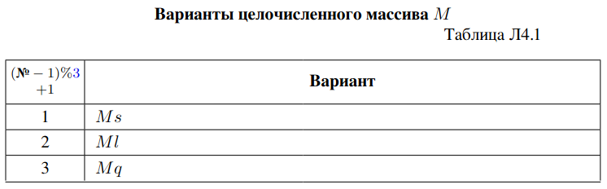
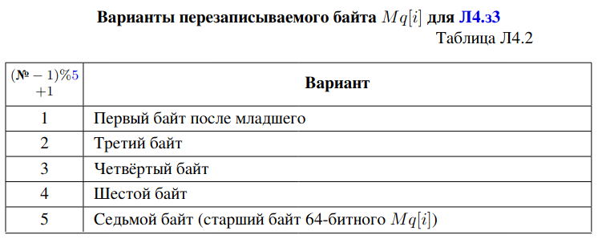
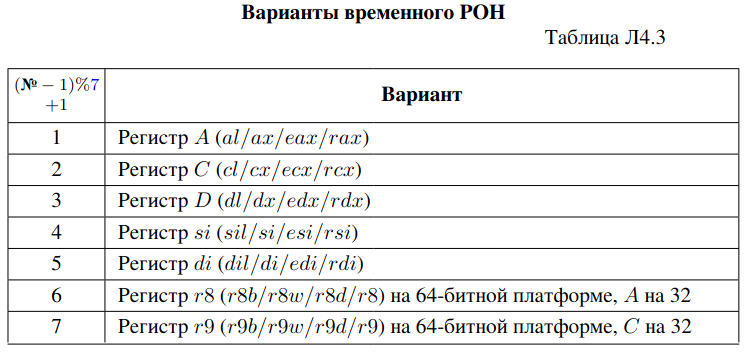
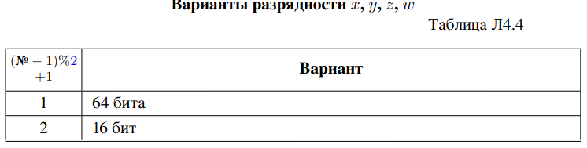
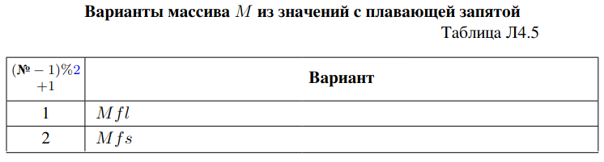

# Лабораторная работа 4 (0100 = 4)
# Использование ассемблерных вставок в программах на C++. Команды пересылки

## Задание на лабораторную работу
### Задание Л4.з1. 
Как в задании Л1.з4, создайте массивы 𝑀𝑠 из 16-битных целых чисел, 𝑀𝑙 из 32-битных целых чисел, 𝑀𝑞 из 64 - битных целых чисел (длина и начальные значения аналогичны Л1.з4).

Реализуйте для каждого массива 𝑀 вставку, записывающую непосредственное
значение 16 в 𝑀 [𝑖] для заданного 𝑖 ∈ [0, 𝑁 ) с использованием команды 𝑚𝑜𝑣, где выражение 𝑀 [𝑖] является выходным параметром вставки в памяти. Так как оба операнда 𝑚𝑜𝑣 здесь не имеют определённого размера (непосредственное значение и память), необходимо указывать для 𝑚𝑜𝑣 суффикс размера: 𝑚𝑜𝑣𝑤, 𝑚𝑜𝑣𝑙, 𝑚𝑜𝑣𝑞.

Здесь и далее все целочисленные массивы до и после изменения выводите
в шестнадцатеричном представлении.

```c++
#include <iostream>
#define N 5

#define PRINT_i(arr,type)\
    std::cout << "\n"#arr " in hex:     "; \
    for (int i = 0; i < N; i++) { printf("%#0*llx ", (int)(sizeof(type)*2 + 2), static_cast<long long>(arr[i]));} \
    std::cout << std::endl;

int main(){
    short xs=0xEADE;
    int xl = 0xADE1A1D;
    long long xq = 0xC1A551F1AB1E;
    short Ms[N]{xs,xs,xs,xs,xs};
    int Ml[N]{xl,xl,xl,xl,xl};
    long long Mq[N]{xq,xq,xq,xq,xq};

    std::cout<<"\n\nshort"<<std::endl;
    PRINT_i(Ms,short);
    asm volatile(
        "movw $16, %0;\n"
        : "=m" (Ms[2]) 
    );
    PRINT_i(Ms,short);

    std::cout<<"\n\nint"<<std::endl;
    PRINT_i(Ml,int);
    asm volatile(
        "movl $16, %0;\n"
        : "=m" (Ml[2]) 
    );
    PRINT_i(Ml,int);

    std::cout<<"\n\nlong long"<<std::endl;
    PRINT_i(Mq,long long);
    asm volatile( 
        "movq $16, %0;\n"
        : "=m" (Mq[2]) 
    );
    PRINT_i(Mq,long long);


    
    return 0;
}
```
### Задание Л4.з2.
 Реализуйте для одного из массивов 𝑀 (по варианту согласно таблице Л4.1) вставку, записывающую непосредственное (−1) в 𝑀 [𝑖], где адрес начала массива 𝑀 и индекс 𝑖 передаются как входные параметры в регистрах.

Используйте компоненты эффективного адреса (𝐵𝑎𝑠𝑒, 𝐼𝑛𝑑𝑒𝑥, $2^{𝑆𝑐𝑎𝑙𝑒}$). Разрядность компонент 𝐵𝑎𝑠𝑒 и 𝐼𝑛𝑑𝑒𝑥 должна быть одинаковой, поэтому для переносимости вставки необходимо объявить переменную 𝑖 не как 𝑖𝑛𝑡 (4 байта как для 32-, так и для 64-битного режимов), а как 𝑠𝑖𝑧𝑒_𝑡 (размер равен размеру указателя).



```c++
#include <iostream>

#define N 5

#define PRINT_i(arr, type) \
    std::cout << "\n" #arr " in hex:     "; \
    for (int i = 0; i < N; i++) { \
        printf("%#0*llx ", (int)(sizeof(type) * 2 + 2), static_cast<long long>(arr[i])); \
    } \
    std::cout << std::endl;

int main() {
    int xl = 0xADE1A1D;
    int Ml[N]{xl, xl, xl, xl, xl};
    size_t index = 2;
    int *base = Ml;

    std::cout << "\n\nint" << std::endl;
    PRINT_i(Ml, int);

    asm volatile(
        "movl $-1, (%0,%1,4)\n\t" // Store (-1) at M[i] where i = index
        : 
        : "r"(base), "r"(index)
        : "eax", "ecx", "memory"
    );

    PRINT_i(Ml, int);

    return 0;
}
```
### Задание Л4.з3.
 Реализуйте вставку, записывающую непосредственное значение 0xBB в заданный байт 𝑀 𝑞[𝑖] (по варианту согласно таблице Л4.2; младший байт считайте нулевым) с использованием одной команды 𝑚𝑜𝑣 (𝑚𝑜𝑣𝑏) и всех компонент эффективного адреса 𝐷𝑖𝑠𝑝(𝐵𝑎𝑠𝑒, 𝐼𝑛𝑑𝑒𝑥, 2𝑆𝑐𝑎𝑙𝑒); адрес начала массива $𝑀_𝑞$ и индекс 𝑖 передаются как входные параметры в регистрах.



```c++
#include <iostream>

#define N 5

#define PRINT_i(arr, type) \
    std::cout << "\n" #arr " in hex:     "; \
    for (int i = 0; i < N; i++) { \
        printf("%#0*llx ", (int)(sizeof(type) * 2 + 2), static_cast<long long>(arr[i])); \
    } \
    std::cout << std::endl;

int main() {
    long long xq = 0xC1A551F1AB1E;
    long long Mq[N]{xq,xq,xq,xq,xq};
    size_t index = 2;
    long long *base = Mq;

    std::cout << "\n\nint" << std::endl;
    PRINT_i(Mq, long long);

    asm volatile(    
        "movb $0xBB, 0x3(%0,%1,8)\n\t" // Store (-1) at M[i] where i = index
        : 
        : "r"(base), "r"(index)
        : "rax", "rcx", "memory"
    );

    PRINT_i(Mq, long long);

    return 0;
}
```
### Задание Л4.з4.
 Реализуйте вставку, записывающую в 𝑀 [𝑖] значение 𝑥 (𝑀 по варианту согласно таблице Л4.1; размер переменной 𝑥 равен размеру элемента 𝑀 ),где значение 𝑥 передаётся как входной параметр в памяти, 𝑀 и 𝑖 — как входные параметры в регистрах.

Так как команда x86 не может адресовать два операнда в памяти, прямая пересылка 𝑥 → 𝑀 [𝑖] невозможна; используйте промежуточный регистр (таблица Л4.3).



```c++
#include <iostream>

#define N 5

#define PRINT_i(arr, type) \
    std::cout << "\n" #arr " in hex:     "; \
    for (int i = 0; i < N; i++) { \
        printf("%#0*llx ", (int)(sizeof(type) * 2 + 2), static_cast<long long>(arr[i])); \
    } \
    std::cout << std::endl;

int main() {
    int xl = 0xADE1A1D;
    int Ml[N]{xl, xl, xl, xl, xl};
    int x=8;
    size_t index = 2;
    int *base = Ml;

    std::cout << "\n\nint" << std::endl;
    PRINT_i(Ml, int);

    asm volatile(
        "movl %2, %%ecx\n\t"
        "movl %%ecx, (%0,%1,4)\n\t" 
        : 
        : "r"(base), "r"(index),"m"(x)
        : "eax", "ecx", "memory"
    );

    PRINT_i(Ml, int);

    return 0;
}
```
### Задание Л4.з5. 
Реализуйте вставку, записывающую в 𝑀 [𝑖] значение 𝑥 аналогично Л4.з4, но во вставку передаётся адрес &𝑥.
```c++
#include <iostream>

#define N 5

#define PRINT_i(arr, type) \
    std::cout << "\n" #arr " in hex:     "; \
    for (int i = 0; i < N; i++) { \
        printf("%#0*llx ", (int)(sizeof(type) * 2 + 2), static_cast<long long>(arr[i])); \
    } \
    std::cout << std::endl;

int main() {
    int xl = 0xADE1A1D;
    int Ml[N]{xl, xl, xl, xl, xl};
    int x = 8;
    size_t index = 2;
    int *base = Ml;

    std::cout << "\n\nint" << std::endl;
    PRINT_i(Ml, int);

    asm volatile(
        "movl (%2), %%ecx\n\t"
        "movl %%ecx, (%0,%1,4)\n\t" 
        : 
        : "r"(base), "r"(index), "r"(&x) 
        : "ecx", "memory"
    );

    PRINT_i(Ml, int);

    return 0;
}

```

### Задание Л4.з6.
 Реализуйте вставку, рассчитывающую для целочисленных 𝑥
и 𝑦 значения 𝑧 = 𝑥 + 𝑦 и 𝑤 = 𝑥 − 𝑦 при помощи команд 𝑎𝑑𝑑 и 𝑠𝑢𝑏. Разрядность
указана в таблице Л4.4; переменные 𝑥, 𝑦, 𝑧, 𝑤 передаются во вставку как параметры
(𝑧 и 𝑤 — выходные, 𝑥 и 𝑦 — входные).



```c++
#include <iostream>


int main() {
    short x=8;
    short y=9;
    short z=0;
    short w=0;

    asm volatile(
        "movw %2,%%ax\n\t" // x to eax
        "movw %3, %%cx\n\t" // y to ecx
        "add %%ax,%0 \n\t" // z = z + x
        "add %%cx,%0 \n\t" // z = z + y
        "add %%ax,%1 \n\t" // w = w + x
        "sub %%cx,%1 \n\t" // w = w + y
        : "=m"(z),"=m"(w)
        : "m"(x), "m"(y)
        : "ax", "cx", "memory"
    );
    std::cout<<"z = "<<z<<std::endl;
    std::cout<<"w = "<<w<<std::endl;
    return 0;
}
```
### Задание Л4.з7.
 Определите, доступны ли на выбранной платформе расширения AVX и SSE, используя команду 𝑐𝑝𝑢𝑖𝑑 или документацию на процессор.

Как в задании Л1.з4, создайте массивы 𝑀 𝑓 𝑙 из 64- битных чисел с плавающей запятой и 𝑀 𝑓 𝑠 из 32-битных чисел с плавающей запятой.

Реализуйте вставку, записывающую в 𝑀 [𝑖] значение 𝑥 с плавающей запятой аналогично Л4.з4 (𝑀 по варианту согласно таблице Л4.5; размер переменной 𝑥 равен размеру элемента 𝑀 ; 𝑥, 𝑀 и 𝑖 — параметры вставки), используя команды AVX 𝑣𝑚𝑜𝑣𝑠𝑑/𝑣𝑚𝑜𝑣𝑠𝑠 или их SSE-аналоги 𝑚𝑜𝑣𝑠𝑑/𝑚𝑜𝑣𝑠𝑠. Используйте промежуточный регистр 𝑥𝑚𝑚 i, где номер регистра 𝑖 ∈ [0, 5] рассчитывается как $(№ − 1)\%6$ (по варианту).



```c++
#include <iostream>
#define N 5
#define PRINT_f(arr,type)\
    std::cout << "\n\n"#arr " in decimal: "; \
    for (int i = 0; i < N; i++) { printf("%.2f ", arr[i]); } \
    std::cout<<std::endl;
int main() {
    bool AVX_bit;
    asm(
        "cpuid\n"
        "test $(1 << 28), %%ecx\n"
        : "=@ccnz"(AVX_bit)
        : "a"(1)
        : "ebx", "ecx", "edx", "cc"
    );
    std::cout<<"AVX_bit = "<<AVX_bit<<std::endl;
    std::cout<<"AVX is available"<<std::endl;

    float x1 = -8.0f/5.0f;
    float Mfs[N]{x1,x1,x1,x1,x1};
    PRINT_f(Mfs,float);
    float x=4.8;
    size_t index = 2;
    float *base = Mfs;
    asm(
        "movss %2, %%xmm1\n\t"
        "movss %%xmm1, (%0,%1,4)\n\t" 
        : 
        : "r"(base), "r"(index),"m"(x)
        : "xmm1", "memory"
    );
    PRINT_f(Mfs,float);
    
    return 0;
}
```
### Задание Л4.з8.
 Реализуйте вставку, записывающую в 𝑀 [𝑖] значение с плавающей запятой, равное целочисленному значению 𝑥. Преобразование целочисленного 𝑥 к нужному виду выполните при помощи команд AVX 𝑣𝑐𝑣𝑡𝑠𝑖2𝑠𝑑 $/$ 𝑣𝑐𝑣𝑡𝑠𝑖2𝑠𝑠 или их SSE-аналогов 𝑐𝑣𝑡𝑠𝑖2𝑠𝑑 $/$ 𝑐𝑣𝑡𝑠𝑖2𝑠𝑠.

 ```c++
 #include <iostream>
#define N 5
#define PRINT_f(arr,type)\
    std::cout << "\n\n"#arr " in decimal: "; \
    for (int i = 0; i < N; i++) { printf("%.2f ", arr[i]); } \
    std::cout<<std::endl;

int main() {


    float x1 = -8.0f/5.0f;
    float Mfs[N]{x1,x1,x1,x1,x1};
    PRINT_f(Mfs,float);
    int x=4;
    size_t index = 2;
    float *base = Mfs;
    asm(
        "cvtsi2ss %2, %%xmm1\n\t"
        "movss %%xmm1, (%0,%1,4)\n\t" 
        : 
        : "r"(base), "r"(index),"m"(x)
        : "xmm1", "memory"
    );
    PRINT_f(Mfs,float);
    
    return 0;
}
 ```