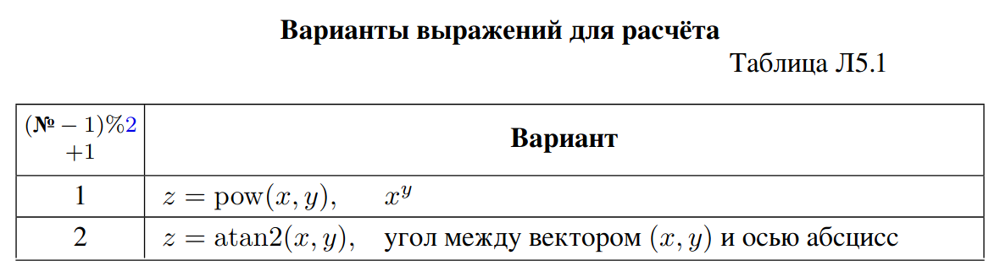

# Лабораторная работа 5 (0101 = 5)
# Модули и функции. Вызов функций стандартной библиотеки C (libc и libm)

## Задания 

### Задание Л5.з1.
 Разработайте программу, выводящую на стандартный вывод
группу, номер и состав команды при помощи функции 𝑝𝑢𝑡𝑠() библиотеки libc
(аналогично заданию Л1.з1).

```asm
.data
        msg:
        .string "Группа: ПМ-32 \nКоманда №2 \nСостав: Каранкевич M., Комбаров Д., Комольцева Д.\n"
.LC0:
        .string "russian"
.text
.globl main
main:
        sub $8, %rsp
        lea msg(%rip), %rdi
        mov $0, %al
        call puts 
        add $8, %rsp
        xor %eax, %eax
        ret
```


### Задание Л5.з2.
 Выделите в стеке 𝑚𝑎𝑖𝑛() место под переменные нескольких
типов (по значению на каждый тип):
– 16-битное целое;
– 32-битное целое;
– 64-битное целое;
– 32-битное число с плавающей запятой;
– 64-битное число с плавающей запятой.
с учётом выравнивания — адрес переменной должен быть кратен как минимум
её размеру. Введите в каждую из выделенных областей памяти по значению соответствующего типа при помощи 𝑠𝑐𝑎𝑛𝑓 (). Напечатайте значения из памяти при помощи 𝑝𝑟𝑖𝑛𝑡𝑓 (). Обратите внимание, что 𝑝𝑟𝑖𝑛𝑡𝑓 () и 𝑠𝑐𝑎𝑛𝑓 () имеют переменное число аргументов, что во многих соглашениях требует дополнительных действий.

### Задание Л5.з3.
 Разработайте программу, вычисляющую по введённым значениям 𝑥 и 𝑦 с плавающей запятой двойной точности значение 𝑧 (таблица Л5.1), вызывая функции libm 𝑝𝑜𝑤() / 𝑎𝑡𝑎𝑛2().

Если программа не собирается из-за отсутствия ссылок на 𝑝𝑜𝑤()/𝑎𝑡𝑎𝑛2(), добавьте к команде сборки ключ -lm (указание компоновщику использовать libm).


### Задание Л5.з4. Бонус +2 балла для пар, обязательное для троек.
Реализуйте задания Л5.з2–Л5.з3 для платформы с иным соглашением о вызовах (то есть если задания Л5.з2–Л5.з3 выполнялись под 64-битной GNU/Linux — реализуйте их дополнительно и для 64-битной MS Windows, или для любой 32-битной системы)


## Л5.1. Дополнительные бонусные и штрафные баллы
**−2 балла** за хранение локальных переменных в сегменте данных (использова-
ние статических/глобальных констант допускается).
**−3 балла** за нарушение соглашения о вызовах (даже если в данной конкретной программе это не имеет видимых проявлений).